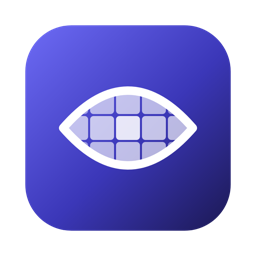

<div dir="rtl">



# Sitr «ستر»

[English](README.md)

Sitr تطبيق لشريط القائمة في macOS يخفي الأشخاص على شاشتك لحظة ظهورهم — النساء أو الرجال أو الجميع — في كل التطبيقات:
المتصفحات وتطبيقات المحادثة ومكتبات الصور ومشغّلات الفيديو ومكالمات الفيديو. يلتقط الشاشة عبر ScreenCaptureKit، ويكتشف
الأشخاص بنماذج Core ML على المحرّك العصبي (Neural Engine)، ويصنّف كل شخص إلى امرأة أو رجل أو غير معروف، ثم يغطي كامل جسم
كل شخص في الفئة التي اخترتها بتمويه أو بكسلة أو لون مصمت.

كل شيء يعمل على جهازك. Sitr يعمل داخل صندوق الحماية (App Sandbox) ولا يحمل أي صلاحية للشبكة، فلا يستطيع فتح أي اتصال
شبكي: لا تخرج من الجهاز بكسلات ولا سجلات ولا بيانات قياس ولا تقارير أعطال. تبقى الإطارات في الذاكرة ولا تُكتب على القرص
أبدًا. يمكنك التحقق من ذلك بنفسك، انظر [التحقق من الخصوصية](#التحقق-من-الخصوصية).

## المتطلبات

- macOS 15 أو أحدث.
- جهاز Mac بشريحة Apple silicon (M1 أو أحدث). أجهزة Intel غير مدعومة.
- إذن «تسجيل الشاشة وصوت النظام» (الفيديو فقط؛ لا يسجّل Sitr الصوت أبدًا).

## التثبيت

**ملف DMG.** نزّل `Sitr-<version>.dmg` من صفحة [إصدارات GitHub](https://github.com/haithamassoli/Sitr/releases)،
وافتحه، واسحب `Sitr` إلى `Applications`، ثم شغّله. إصدارات النشر موقّعة بشهادة Developer ID ومصدّق عليها من Apple
(notarized). يحمل ملف `checksums.txt` المرفق بصمة SHA-256 للملف؛ يجب أن يطبع الأمر `shasum -a 256 Sitr-<version>.dmg`
السطر نفسه.

**Homebrew** (يتوفر بعد الإصدار الأول):

</div>

```sh
brew install --cask haithamassoli/sitr/sitr
```

<div dir="rtl">

## التشغيل الأول

لا يملك Sitr أيقونة في الـ Dock؛ ابحث عن أيقونة العين المشطوبة في شريط القائمة. يفتح التشغيل الأول نافذة إعداد من خمس
خطوات:

1. ما يفعله Sitr، وأمر التحقق.
2. **تسجيل الشاشة.** انقر *السماح بتسجيل الشاشة* ووافق على مربع حوار macOS، أو افتح إعدادات النظام › الخصوصية والأمن ›
   تسجيل الشاشة وصوت النظام وفعّل Sitr. يتابع الإعداد من تلقاء نفسه بعد منح الإذن. من دونه لا يغطي Sitr أي شيء ويعرض
   أيقونة تحذير.
3. **مَن يجب إخفاؤه:** النساء أو الرجال أو الجميع. خيار *تمويه غير المعروف (الوضع الصارم)* مفعّل افتراضيًا ويغطي أيضًا
   الأشخاص الذين لا يستطيع Sitr تصنيفهم؛ خيار «الجميع» يشملهم دائمًا.
4. **الحماية الموصى بها:** طبّق الإعدادات المسبقة أدناه، أو اضبط القواعد بنفسك.
5. اختصار الكشف المؤقت، وخيار *التشغيل عند تسجيل الدخول*.

### إعادة الموافقة الشهرية

بدءًا من macOS 15.1 يطلب النظام إعادة الموافقة على تسجيل الشاشة لكل تطبيق مرة كل شهر تقريبًا. عند انقضاء الإذن تظهر
شارة تحذير على أيقونة Sitr في شريط القائمة، ويصبح سطر الحالة *يلزم إذن تسجيل الشاشة*، ويُرسَل إشعار واحد، وتعود خطوة
الإذن من نافذة الإعداد. إلى أن يُستأنف الالتقاط، تُغطَّى تطبيقات وضع الستارة بلون مصمت فوق كل نافذة، أما تطبيقات وضع
التمويه فتبقى مكشوفة.

## كيف تعمل الحماية

يعمل كل تطبيق بواحد من ثلاثة أوضاع:

| الوضع | ما يحدث |
|---|---|
| **إيقاف** | لا يُلتقط التطبيق ولا يُحلَّل أبدًا. |
| **التمويه** | تُلتقط الإطارات وتُحلَّل؛ يُغطَّى الأشخاص من الفئة المحجوبة فور اكتشافهم، أي بعد نحو ١٠٠–٢٠٠ ملّي ثانية من ظهورهم. |
| **الستارة** | تُغطَّى المناطق المتغيّرة من نوافذ التطبيق لحظة تغيّرها، ثم تُكشف بعد أن يتحقق الاكتشاف من أنها آمنة. التعرّض محدود بزمن الالتقاط والرسم، لا صفرًا. المنطقة التي تستمر في التغيّر وتبقى آمنة نصف ثانية (فيديو بلا أشخاص، تمرير طويل) تتصرف كوضع التمويه حتى تعود ساكنة. |

**القاعدة الافتراضية** هي وضع كل تطبيق ليس له استثناء. قيمتها الأولية «إيقاف»، لذا لا يغطي التثبيت الجديد أي شيء حتى
تضيف قواعد؛ ضبطها على التمويه أو الستارة يحمي جهاز Mac بالكامل. **الاستثناءات** في الإعدادات › الحماية تعيّن وضعًا لكل
تطبيق: اختر تطبيقًا قيد التشغيل، أو أي ملف `.app`.

**الإعدادات الموصى بها**، تُعرض أثناء الإعداد وتتوفر في الإعدادات › الحماية › *استخدام الإعدادات الموصى بها* (تبقى
القاعدة الافتراضية على الإيقاف):

| المجموعة | التطبيقات | الوضع |
|---|---|---|
| المتصفحات | Safari وChrome وArc | الستارة |
| التواصل | Telegram وWhatsApp وDiscord | الستارة |

**الفئات.** كل شخص مكتشَف إما امرأة أو رجل أو غير معروف. «غير معروف» يعني من يولّي ظهره، أو وجهه مخفي أو صغير جدًا، أو
بعيد جدًا، أو ثقة المصنّف أقل من ٨٠٪. الفئة المحجوبة هي النساء أو الرجال أو الجميع. *تمويه غير المعروف (الوضع الصارم)*
يضيف «غير معروف» إلى الفئة المحجوبة، وهو مفعّل إجباريًا عند اختيار «الجميع».

**الأغطية.** يُغطَّى مربع الجسم الكامل، بعد توسيعه بمقدار *هامش الجسم* (١٥٪ افتراضيًا)، بالنمط المختار في الإعدادات ›
المظهر: تمويه غاوسي (الافتراضي، بشدة ٧٠٪) أو بكسلة أو مصمت. يظهر الغطاء عند أول إطار يُكتشف فيه الشخص ويبقى لحظات بعد
مغادرته حتى لا يومض.

**الكشف المؤقت.** اضغط باستمرار على ⌃⌥Space لرؤية ما تحت الأغطية على كل الشاشات، وأفلته لتعود التغطية. للأمان، تعود
الأغطية بعد ٣٠ ثانية من الضغط المستمر، أو عند إفلات مفاتيح التعديل من دون وصول حدث الإفلات. الكشف غير متاح أثناء إيقاف
الحماية مؤقتًا أو تعطيلها، أو عند غياب الإذن. يمكنك تغيير الاختصار من الإعدادات › الاختصارات؛ يُرفض ⌥Space لأن Siri
وتطبيق ChatGPT يستخدمانه.

**شريط القائمة.** يعرض سطر الحالة: الحماية مفعّلة، أو الحماية متوقفة مؤقتًا حتى وقت محدد، أو الحماية معطّلة، أو يلزم إذن
تسجيل الشاشة، أو أداء الحماية منخفض. *إيقاف الحماية مؤقتًا* لمدة ١٥ دقيقة أو ساعة واحدة يزيل كل الأغطية ويستأنف الحماية
تلقائيًا؛ *تعطيل الحماية* يبقيها معطّلة حتى تفعّلها مجددًا. تبدو الأيقونة خافتة أثناء الإيقاف المؤقت أو التعطيل، وتحمل
شارة تحذير عند غياب الإذن أو عندما يعمل الاكتشاف ببطء.

## التحقق من الخصوصية

نفّذ هذا الأمر في الطرفية (Terminal) (تعرض الإعدادات › حول الأمر نفسه مع زر نسخ):

</div>

```sh
codesign -d --entitlements :- --xml /Applications/Sitr.app
```

<div dir="rtl">

الناتج المتوقع (أضف `| plutil -convert xml1 -o - -` إلى الأمر للحصول على هذا الشكل المنسّق):

</div>

```xml
<?xml version="1.0" encoding="UTF-8"?>
<!DOCTYPE plist PUBLIC "-//Apple//DTD PLIST 1.0//EN" "http://www.apple.com/DTDs/PropertyList-1.0.dtd">
<plist version="1.0">
<dict>
	<key>com.apple.security.app-sandbox</key>
	<true/>
	<key>com.apple.security.files.user-selected.read-only</key>
	<true/>
</dict>
</plist>
```

<div dir="rtl">

قيمة `com.apple.security.app-sandbox` هي `true`، ولا يوجد مفتاح `com.apple.security.network.client` ولا
`com.apple.security.network.server`: يرفض صندوق الحماية كل اتصال قد تحاول العملية فتحه. الصلاحية الثانية تسمح لـ Sitr
فقط بقراءة معرّف الحزمة لملف `.app` تختاره في مربع حوار الإضافة في الإعدادات › الحماية. يُجري نظام التكامل المستمر (CI)
الفحص نفسه في كل بناء (`scripts/check-entitlements.sh`).

## مشاركة الشاشة ولقطات الشاشة

- **مشاركة الشاشة بالكامل** (Zoom وFaceTime وMeet وغيرها): طبقة التغطية نافذة عادية فوق كل شيء، لذا يرى المشاهدون
  الأغطية عادةً.
- **مشاركة نافذة واحدة:** طبقة التغطية ليست جزءًا من تلك النافذة، لذا لا يُضمن وصول الأغطية إلى المشاهدين.
- **لقطات الشاشة وتسجيلات الشاشة** تتضمن الأغطية.

لا يحاول Sitr إخفاء أغطيته عن مشاركة الشاشة أو لقطات الشاشة: الشخص المغطّى على شاشتك مغطّى في الالتقاط أيضًا.

## الأداء

يعمل الاكتشاف بمعدل يصل إلى ١٥ إطارًا في الثانية (٨ في نمط الطاقة المنخفضة عند تفعيل الخيار في الإعدادات › عام)، وعلى
الشاشات والتطبيقات التي تحتاجه فقط، ويتجاوز الإطارات التي لم يتغيّر فيها شيء. الأهداف التي يُبنى Sitr ويُقاس عليها على
جهاز M1 بذاكرة 8 GB هي: من ظهور الشخص إلى تغطيته في ١٥٠ ملّي ثانية على الأكثر (المئين الخامس والتسعون) في وضع التمويه
و٥٠ ملّي ثانية في وضع الستارة؛ استجابة ضغط أو إفلات الكشف المؤقت خلال إطار واحد؛ أقل من ١٪ من المعالج عند سكون الشاشة،
ونحو ١٥٪ من نواة أداء واحدة أثناء التصفح، ونحو ٢٥٪ أثناء فيديو 1080p فيه أشخاص؛ وأقل من 300 MB من الذاكرة. الشرائح
الأحدث تحقق نتائج أفضل تبعًا لذلك. قد يؤخر انشغال معالج الرسوميات (الألعاب، تصدير الفيديو) الأغطية، وهو ما يعرضه شريط
القائمة بالحالة «أداء الحماية منخفض».

## البناء من المصدر

المتطلبات: Xcode 26 (Swift 6 وحزمة تطوير macOS 15) على جهاز Apple silicon. لا يوجد مشروع Xcode؛ Sitr حزمة Swift.

</div>

```sh
git clone https://github.com/haithamassoli/Sitr.git && cd Sitr
swift build                                    # every target
swift test                                     # unit tests: policy, tracker, curtain, settings, onboarding, localization, model checksums
scripts/build-app.sh                           # assembles build/Sitr.app: Info.plist, Core ML models, String Catalog, ad-hoc signature
scripts/check-entitlements.sh build/Sitr.app   # sandbox on, no network entitlement
scripts/check-strings.sh                       # every UI string is in the String Catalog with an Arabic translation
```

<div dir="rtl">

`build/Sitr.app` موقّع توقيعًا مؤقتًا (ad hoc)، لذا يعامله macOS كتطبيق بنيته بنفسك؛ شغّله من Finder أو نفّذ
`build/Sitr.app/Contents/MacOS/Sitr` من الطرفية. تُنتَج إصدارات النشر عبر `scripts/release.sh` و`scripts/make-dmg.sh`،
انظر `docs/m5/release.md`.

نموذجا Core ML مضمّنان في المستودع تحت `Models/dist/`: لا خطوة تنزيل ولا وصول إلى الشبكة أثناء البناء. يسرد الملفان
`Models/dist/CHECKSUMS.txt` و`Models/dist/CHECKSUMS-PersonDetector.txt` بصمة SHA-256 لكل ملف داخل الحزمتين، ويفشل
الاختبار `ModelChecksumTests` عند اختلاف أي شيء. يدويًا:
`cd Models/dist && shasum -a 256 -c CHECKSUMS.txt CHECKSUMS-PersonDetector.txt`.

## النماذج والتراخيص

| النموذج | المصدر | الترخيص |
|---|---|---|
| كاشف الأشخاص، `PersonDetector.mlpackage` | YOLOX-S من Megvii Inc.، محوَّل إلى Core ML دون إعادة تدريب | Apache-2.0 |
| مصنّف الجنس، `GenderClassifier.mlpackage` | `dima806/fairface_gender_image_detection` ‏(ViT-B/16)، محوَّل إلى Core ML دون إعادة تدريب؛ مدرَّب على FairFace | Apache-2.0؛ بيانات FairFace بترخيص CC BY 4.0 |

المصدر وأوامر التحويل ونصوص التراخيص الكاملة: [`THIRD_PARTY_NOTICES.md`](THIRD_PARTY_NOTICES.md)
و`Models/dist/SOURCE.md` و`Models/dist/SOURCE-PersonDetector.md`. لا يعتمد Sitr على أي حزم Swift خارجية.

## اللغات

الإنجليزية والعربية، مع تخطيط من اليمين إلى اليسار للعربية. يتبع Sitr ترتيب لغات النظام؛ ويمكن تجاوزه لـ Sitr وحده من
الإعدادات › عام › اللغة، ويُطبَّق التغيير بعد إعادة التشغيل.

## إزالة التثبيت

1. أنهِ Sitr من شريط القائمة (*إنهاء Sitr*).
2. احذف `/Applications/Sitr.app`.
3. احذف `~/Library/Containers/com.goldentik.Sitr`، وهو حاوية صندوق الحماية التي تحوي إعداداتك وملف القواعد.
4. إذا كان *التشغيل عند تسجيل الدخول* مفعّلًا، أزل Sitr من إعدادات النظام › عام › عناصر تسجيل الدخول والإضافات (حذف
   التطبيق يزيل هذا العنصر تلقائيًا في العادة).

مع Homebrew، يزيل الأمر `brew uninstall --zap --cask sitr` التطبيق والحاوية معًا.

## الترخيص

GPL-3.0-only، انظر [`LICENSE`](LICENSE). التقارير الأمنية: [`SECURITY.md`](SECURITY.md). المساهمات:
[`CONTRIBUTING.md`](CONTRIBUTING.md).

</div>
